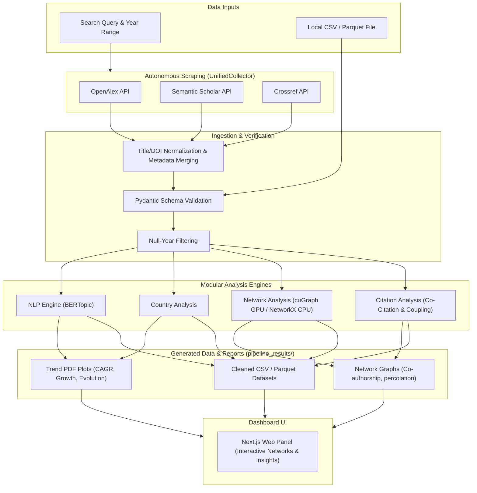

# Bibliometric Research Pipeline

A modular, schema-driven Python pipeline for advanced bibliometric research. It supports autonomous metadata scraping, cross-source deduplication, dynamic keyword CAGR analysis, NLP-based topic clustering (BERTopic), and co-authorship network visualization.

## Key Features

- **Autonomous Collection**: Query and fetch papers across multiple metadata APIs (OpenAlex, Semantic Scholar, and Crossref) with page-based pagination.
- **Smart Merge Deduplication**: Cleans and combines duplicate hits using normalized DOIs and Titles, ensuring no metadata (abstracts, affiliations, or keywords) is discarded.
- **Dynamic Topic Modeling**: Employs BERTopic to identify core research topics from paper abstracts.
- **Network Analysis**: Generates interactive and static co-authorship networks with community Louvain partitioning and PageRank scoring.
- **Geographic & Keyword CAGR Trends**: Tracks the chronological evolution of countries and research keyword growth.
- **Modern Web Dashboard**: Features a fast FastAPI backend and a Next.js (React) visualization panel.

## System Architecture



## Project Structure
To keep Git tracking lightweight and clean, the repository is structured as:
- `/src`: Core source code (API, pipeline orchestration, viz, collectors, network engines).
- `/notebooks`: Contains research Jupyter notebooks (`Authors`, `Citations`, `Keyword`, etc.).
- `/scripts`: Miscellaneous scripts and classifiers.
- `/data` & `/pipeline_results`: Ignored directories for fetched raw datasets and run plots/graphs.

---

## Getting Started

The pipeline runs directly on your machine's hardware using **`uv`** (fast package manager) or standard **`pip`**.

### 1. Run the Web App (Frontend + Backend)
Run the unified, cross-platform runner script at the root:
```bash
python run_local.py
```
This script will automatically resolve Python and Node.js dependencies, link your environment, and spin up:
- **FastAPI backend** on [http://localhost:8000](http://localhost:8000)
- **Next.js dashboard** on [http://localhost:3000](http://localhost:3000)

### 2. Run the CLI Scraper & Pipeline
You can run autonomous collections or execute the analysis pipeline on local files using the `biblio-pipeline` command:

#### A. Fetch papers and run analysis (Autonomous mode)
```bash
# Universal (using the local virtualenv)
.venv/bin/biblio-pipeline --query "brain-computer interface" --limit 200 --start-year 2020 --end-year 2025

# Modern Alternative (if you have 'uv' installed)
uv run biblio-pipeline --query "brain-computer interface" --limit 200 --start-year 2020 --end-year 2025
```

#### B. Run analysis on a local dataset file (e.g. CSV/Parquet output from scrapers)
This generates the yearly growth charts, country collaborations, BERTopic clusters, and co-authorship graphs:
```bash
# Universal (using the local virtualenv)
.venv/bin/biblio-pipeline --file data/collected_brain-computer_interface.csv

# Modern Alternative (if you have 'uv' installed)
uv run biblio-pipeline --file data/collected_brain-computer_interface.csv
```
Outputs (PDFs, CSVs, and interactive network files) will be written directly to the `pipeline_results/` directory.

---

## Citation

If you use this repository or pipeline in your research, please cite it as:

### APA Format
```text
GF, J. (2026). bibliometric (Version 0.1.0) [Computer software]. https://github.com/JohnGF/bibliometric
```

### BibTeX Format
```bibtex
@software{GF_bibliometric_2026,
  author = {GF, John},
  title = {bibliometric},
  version = {0.1.0},
  url = {https://github.com/JohnGF/bibliometric},
  year = {2026}
}
```
