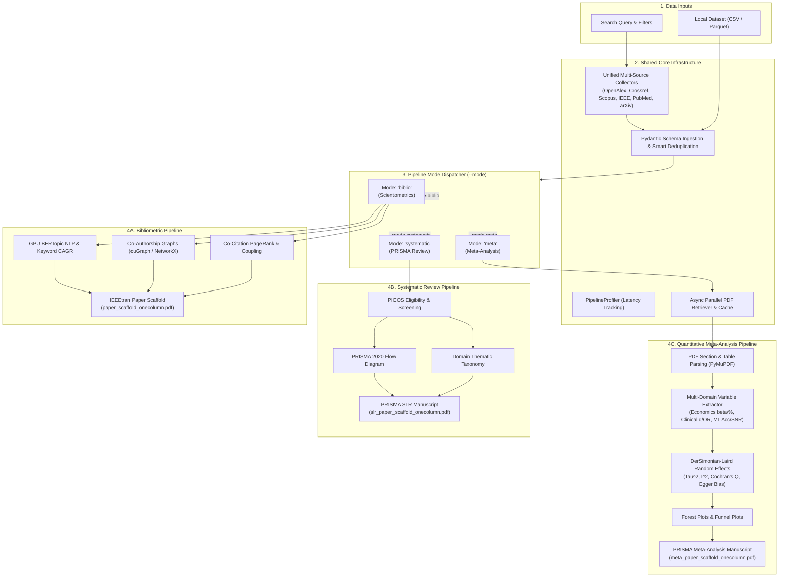

# Bibliometric, Systematic Review & Meta-Analysis Research Pipeline

A modular, schema-driven Python pipeline for academic literature research. It provides three specialized operational modes:
1. **Bibliometrics & Macro Scientometrics (`biblio`)**: Autonomous metadata scraping, co-authorship community graphs, citation PageRank, BERTopic modeling, and IEEEtran manuscript generation.
2. **Qualitative PRISMA Systematic Reviews (`systematic`)**: PICOS inclusion/exclusion screening, audit tracking, PRISMA 2020 flowcharts, and SLR synthesis.
3. **Quantitative Empirical Meta-Analysis (`meta`)**: High-throughput async PDF retrieval, multi-domain variable extraction (Economics, Biomedical, Engineering), DerSimonian–Laird random-effects pooling, Forest plots, Funnel plots, and PRISMA meta-analysis manuscript compilation.

---

## System Architecture


```mermaid
flowchart TD
    %% Inputs
    subgraph Inputs ["1. Data Inputs"]
        in_query["Search Query & Filters"]
        in_file["Local Dataset (CSV / Parquet)"]
    end

    %% Shared Foundations
    subgraph Core ["2. Shared Core Infrastructure"]
        scraping["Unified Multi-Source Collectors\n(OpenAlex, Crossref, Scopus, IEEE, PubMed, arXiv)"]
        ingest["Pydantic Schema Ingestion & Smart Deduplication"]
        profiler["PipelineProfiler (Latency Tracking)"]
        retriever["Async Parallel PDF Retriever & Cache"]
    end

    %% Mode Selection & Dispatcher
    subgraph Dispatcher ["3. Pipeline Mode Dispatcher (--mode)"]
        mode_biblio["Mode: 'biblio'\n(Scientometrics)"]
        mode_slr["Mode: 'systematic'\n(PRISMA Review)"]
        mode_meta["Mode: 'meta'\n(Meta-Analysis)"]
    end

    %% Specialized Pipelines
    subgraph BiblioPipeline ["4A. Bibliometric Pipeline"]
        b_nlp["GPU BERTopic NLP & Keyword CAGR"]
        b_net["Co-Authorship Graphs (cuGraph / NetworkX)"]
        b_cit["Co-Citation PageRank & Coupling"]
        b_doc["IEEEtran Paper Scaffold\n(paper_scaffold_onecolumn.pdf)"]
    end

    subgraph SystematicPipeline ["4B. Systematic Review Pipeline"]
        s_picos["PICOS Eligibility & Screening"]
        s_flow["PRISMA 2020 Flow Diagram"]
        s_tax["Domain Thematic Taxonomy"]
        s_doc["PRISMA SLR Manuscript\n(slr_paper_scaffold_onecolumn.pdf)"]
    end

    subgraph MetaPipeline ["4C. Quantitative Meta-Analysis Pipeline"]
        m_parse["PDF Section & Table Parsing (PyMuPDF)"]
        m_ext["Multi-Domain Variable Extractor\n(Economics beta/%, Clinical d/OR, ML Acc/SNR)"]
        m_stat["DerSimonian-Laird Random Effects\n(Tau^2, I^2, Cochran's Q, Egger Bias)"]
        m_viz["Forest Plots & Funnel Plots"]
        m_doc["PRISMA Meta-Analysis Manuscript\n(meta_paper_scaffold_onecolumn.pdf)"]
    end

    %% Connections
    in_query --> scraping --> ingest
    in_file --> ingest
    ingest --> Dispatcher

    Dispatcher -->|--mode biblio| mode_biblio --> b_nlp & b_net & b_cit --> b_doc
    Dispatcher -->|--mode systematic| mode_slr --> s_picos --> s_flow & s_tax --> s_doc
    Dispatcher -->|--mode meta| mode_meta --> retriever --> m_parse --> m_ext --> m_stat --> m_viz --> m_doc
```

---

## Operational Modes & Workflow Commands

### 1. Quantitative Meta-Analysis Mode (`--mode meta`)
Extracts empirical effect sizes, executes random-effects pooling, renders Forest/Funnel plots, and compiles a PRISMA meta-analysis paper:
```bash
# Direct on dataset:
uv run biblio-pipeline --file data/collected_rent_control.csv --mode meta --output results_meta

# Autonomous search & meta-analysis:
uv run biblio-pipeline --query "rent control" --mode meta --limit 100 --output results_meta
```

### 2. Systematic Literature Review Mode (`--mode systematic`)
Evaluates studies against PICOS criteria, generates PRISMA 2020 flow diagrams, and compiles an SLR manuscript:
```bash
uv run biblio-pipeline --file data/collected_rent_control.csv --mode systematic --output results_slr
```

### 3. Bibliometric Mode (`--mode biblio`)
Analyzes macro scientometrics, co-authorship networks, citation structure, and keyword trends:
```bash
# Host CPU/PyTorch execution:
uv run biblio-pipeline --query "brain-computer interface" --mode biblio --limit 200

# GPU Acceleration with Podman (NVIDIA RAPIDS cuGraph):
podman run -i --rm --ipc=host --device nvidia.com/gpu=all -v .:/app:z biblio-pipeline \
  --query "brain-computer interface" --mode biblio --limit 200
```

---

## Multi-Domain Quantitative Extraction Engine

The variable extractor ([`src/core/extraction.py`](src/core/extraction.py)) dynamically adapts to scientific fields and standardizes reported findings into universal effect sizes ($d$):

| Scientific Domain | Extracted Primary Variables | Mathematical Standardization |
| :--- | :--- | :--- |
| **Economics & Policy** *(e.g., Rent Control, Minimum Wage)* | Regression $\beta$, Standard Error $SE(\beta)$, $\% \Delta$, Elasticity $\epsilon$, $t$-stat | $d \approx \frac{2 \cdot t}{\sqrt{N}}$ where $t = \frac{\beta}{SE(\beta)}$ |
| **Biomedical & Clinical** *(e.g., Clinical Trials, Therapies)* | Sample sizes $N_1, N_2$, Mean $\pm$ SD, Odds Ratio (OR), Risk Ratio (RR) | $d = \frac{\ln(\text{OR}) \cdot \sqrt{3}}{\pi}$ (Chinn conversion) |
| **Computer Science & ML** *(e.g., EEG/BCI, Neural Networks)* | Accuracy $\% \Delta$, F1-score, Area Under Curve (AUC), SNR (dB) | $d \approx (\text{Accuracy} - 0.50) \times 2.5$ |

---

## Web Dashboard & Interactive Analysis

Run the full-stack dashboard (FastAPI backend + Next.js frontend) directly on your hardware:
```bash
python run_local.py
```
- **Backend API**: [http://localhost:8000](http://localhost:8000)
- **Frontend Dashboard**: [http://localhost:3000](http://localhost:3000)

---

## Citation

If you use this pipeline in your research, please cite it as:

```bibtex
@software{GF_bibliometric_2026,
  author = {GF, John},
  title = {bibliometric: Modular Bibliometric, Systematic Review & Meta-Analysis Pipeline},
  version = {0.2.0},
  url = {https://github.com/JohnGF/bibliometric},
  year = {2026}
}
```
