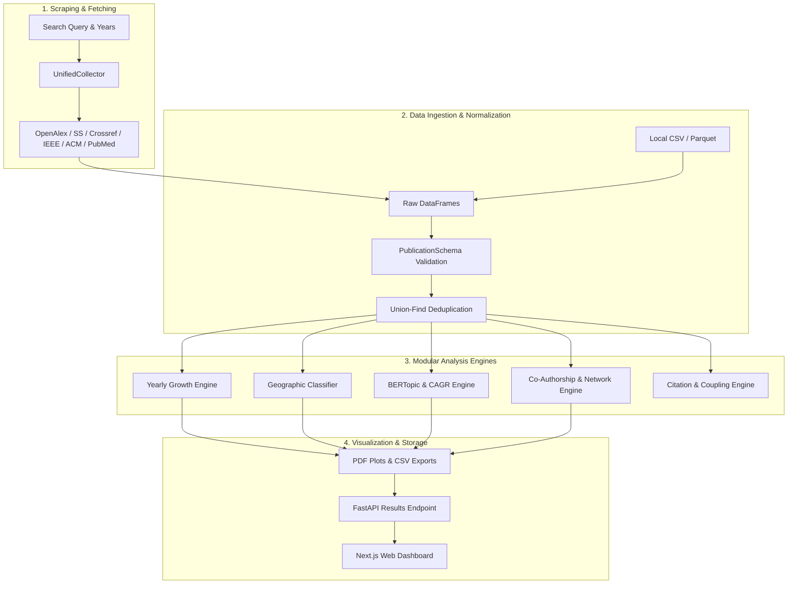

# System Architecture & Data Pipeline

[Back to Wiki Home](file:///run/media/john/ssd%20external%20storage/git/bibliometric/docs/wiki/Home.md)

---

## High-Level Data Flow

The Bibliometric Research Pipeline transforms raw multi-source publication queries or raw dataset files into validated datasets, network graphs, topic clusters, and interactive dashboards.

---

## 1. Data Schemas & Validation

All incoming records across APIs or local CSV files are parsed through Pydantic's `PublicationSchema` in [src/core/ingestion.py](file:///run/media/john/ssd%20external%20storage/git/bibliometric/src/core/ingestion.py).

### Standard Publication Schema Fields
Field Name | Type | Description
--- | --- | ---
`title` | `str` | Cleaned publication title
`abstract` | `Optional[str]` | Full text abstract
`authors` | `str` | Semicolon-delimited list of author names (`Author A; Author B`)
`year` | `int` | Publication year
`affiliations` | `Optional[str]` | Semicolon-delimited institutional/country affiliations
`doi` | `Optional[str]` | Normalized Digital Object Identifier
`eid` | `Optional[str]` | Scopus or OpenAlex unique entity ID
`author_keywords` | `Optional[str]` | Author-specified keywords
`cite_count` | `int` | Citation count
`source` | `str` | Origin source name(s)

---

## 2. Union-Find Deduplication Algorithm

Multi-source searches often return identical papers from different publishers. `UnifiedCollector.deduplicate_dataframe` in [src/core/collection.py](file:///run/media/john/ssd%20external%20storage/git/bibliometric/src/core/collection.py#L80) uses a **Disjoint-Set Union (Union-Find)** algorithm to merge records transitively.

### Merging Rules
1. **DOI Match**: Strips URL prefixes (`https://doi.org/`) and normalizes case.
2. **Title Match**: Normalizes titles by stripping punctuation and whitespace.
3. **Transitive Merging**: If Paper A shares a DOI with Paper B, and Paper B shares a title with Paper C, all three records are grouped into a single unified record.
4. **Metadata Preservation**:
   - **Citation Count**: Takes `max(Cite Count)`.
   - **Sources**: Combines into a list (`"OpenAlex, IEEE"`).
   - **Keywords**: Merges and deduplicates semicolon-separated keywords.
   - **Abstract & Affiliations**: Preserves non-empty text strings.
