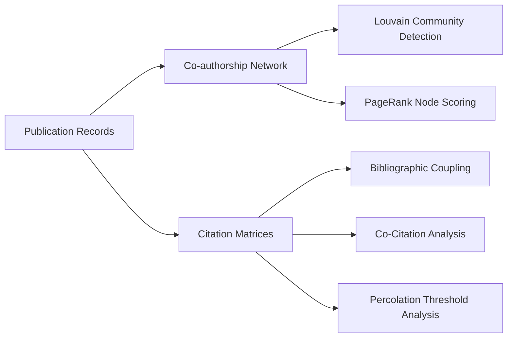

# Network Analysis & Graph Analytics

[Back to Wiki Home](file:///run/media/john/ssd%20external%20storage/git/bibliometric/docs/wiki/Home.md)

---

## Overview

The network analysis engine in [src/core/network.py](file:///run/media/john/ssd%20external%20storage/git/bibliometric/src/core/network.py) constructs and analyzes complex scientific co-authorship and citation networks.

It features **GPU Acceleration (RAPIDS cuGraph)** when running inside NVIDIA-enabled container environments, with automatic fallback to **CPU (NetworkX / python-louvain)** on standard host hardware.

---

## Network Analysis Capabilities

---

## 1. Co-authorship Graph Construction

- **Nodes**: Individual authors extracted from publication records.
- **Edges**: Weighted co-authorship links, where `weight` represents the number of joint publications.
- **Filtering**: Supports `--min-publications N` thresholding to filter out low-frequency authors.

### Graph Analytics Metrics
Metric | Engine | Description
--- | --- | ---
**Louvain Partitioning** | `cugraph.louvain` / `community.best_partition` | Unsupervised modularity optimization for detecting research author clusters.
**PageRank** | `cugraph.pagerank` / `nx.pagerank` | Measures author centrality and global influence in the co-authorship network.

---

## 2. Bibliographic Coupling & Co-Citation Analysis

Implemented in [src/core/citations.py](file:///run/media/john/ssd%20external%20storage/git/bibliometric/src/core/citations.py):

- **Co-Citation Analysis**: Measures how frequently two cited references are cited together by papers in the collected dataset ($C = R^T R$).
- **Bibliographic Coupling**: Measures shared references between papers in the dataset ($B = R R^T$).

---

## 3. Percolation Analysis

Percolation analysis tests network resilience and core-periphery structure by iteratively removing edges below a weight threshold $w_{thresh}$ and tracking the size of the Giant Connected Component (GCC).

Outputs `percolation_results.csv` and static plot `percolation_analysis.pdf`.

---

## 4. Leader Filtering in Static & Web Graphs

Both static PDF generation ([src/core/viz.py](file:///run/media/john/ssd%20external%20storage/git/bibliometric/src/core/viz.py#L141)) and web visualization support **Top Leaders Per Community** filtering:
- `--top-per-community 1`: Keeps only the single top author leader per Louvain partition.
- `--top-per-community N`: Keeps the top N leaders, preventing dense network clutter.
